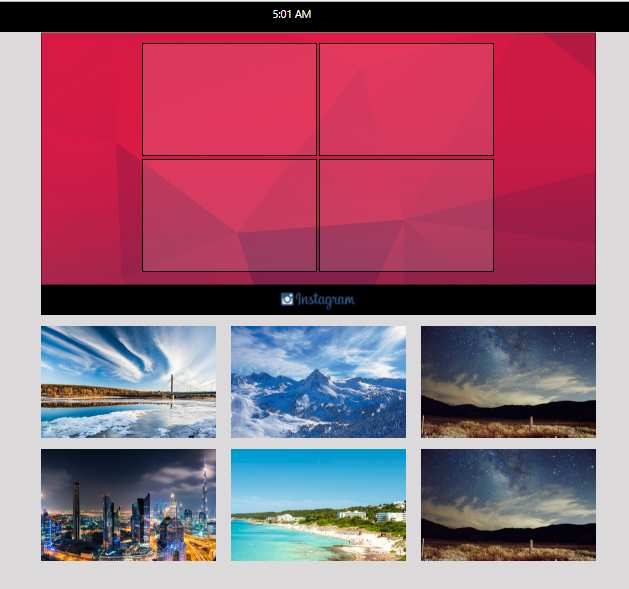

# Cardify

* **Track:** _Common Core_
* **Curso:** _CONSTRUYE UNA SINGLE PAGE APP (SPA) MULTI-USUARIO CONSUMIENDO DATA REMOTA_
* **Unidad:** _Ejercicio Drag and drop_

*** 
[DEMOSTRACION DEL PLUGIN](https://laurajh16.github.io/instaCollage/).

***
## Plan de Accion

1. INSTRUCCIONES.

* Crea tu propio repositorio con el nombre insta-collage.

* Para su desarrollo, solo debes crearlo para mobile.

* Debes usar la API Drag and Drop de HTML5 para crear l collage arrastrando y soltando las imagenes.

* Las imagenes de fotos para elegir deben ser 6 y para el collage minimo son 3.

## PROCESO
* La página principal es denominada **index.html** en el cual se encuentra el login.

* El login se encuentra debidammente validado ,se tiene que ingresar en formato de correo,y el password minimo con 6 digitos.Ejemplo:
 
 - EMAIL-> maribll@guerra.com
 - PASSWORD-> hydg21

* Una vez validado el correo y la contarseña ingresas a la vista **home.htmml** donde localizaras el login con la galeria de images.

* Estando en la pagina **home.html** puedes mover las imagenes de la galeria hacia la parte superior gracias al **Drag and Drop** para formar un collage de 4 imagenes.

## Ejemplos

## Recursos

- Html,css,javascript.
- Jquery.
- Framework, Bootstrap.
- Api,Drag and drow.

## Integrantes(GitHub)

* [LAURA JIMENEZ](https://github.com/LauraJH16)
* [MARINA RODRIGUEZ](https://github.com/MarinaRH)
* [MELINA ](https://github.com/MarinaRH)